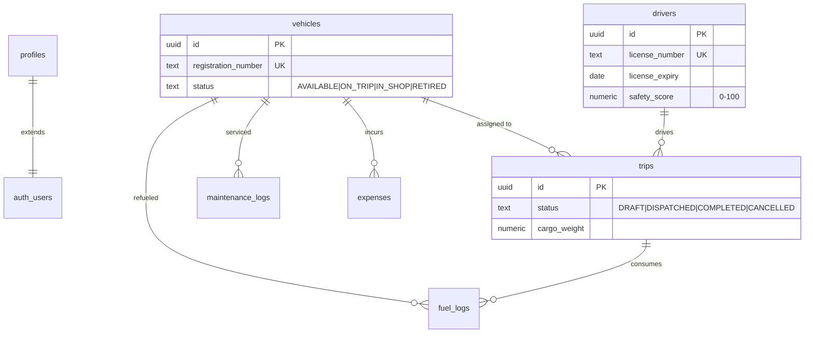

<div align="center">

# 🚛 TransitOps

### *Intelligent Fleet Management for Modern Logistics*

[](https://react.dev/)
[](https://www.typescriptlang.org/)
[](https://supabase.com/)
[](https://vite.dev/)
[](https://tailwindcss.com/)
[](LICENSE)

**A full-stack, real-time fleet management platform that streamlines vehicle tracking, trip dispatch, driver compliance, maintenance scheduling, and financial reporting — all from a single, role-aware dashboard.**

[🚀 Live Demo](#-quick-start) · [📖 Documentation](documentation.md) · [🏗️ Architecture](#-architecture) · [✨ Features](#-features)

---

</div>

## 📌 The Problem

India's logistics sector moves **4.6 billion tonnes of freight annually**, yet **70%+ of fleet operators** still rely on spreadsheets, phone calls, and paper logs to manage vehicles, drivers, and trips. This leads to:

- ❌ **Idle vehicles** — no visibility into fleet utilization
- ❌ **Expired licenses** — compliance violations and safety risks
- ❌ **Revenue leakage** — untracked fuel, toll, and maintenance costs
- ❌ **Dispatch conflicts** — double-booking vehicles and drivers

## 💡 Our Solution

**TransitOps** is a purpose-built fleet operations platform that replaces fragmented workflows with a single source of truth. It enforces business rules at the database level using **atomic RPC transactions**, provides **real-time dashboards** via WebSocket subscriptions, and implements **role-based access control** so every team member sees exactly what they need.

> 🔑 **Key Differentiator:** Zero custom server code. The entire backend runs on **Supabase Postgres** — all business logic lives in SQL functions with row-level security, making it infinitely scalable and impossible to bypass.

---

## ✨ Features

<table>
<tr>
<td width="50%">

### 📊 Real-Time Dashboard
- Live KPI cards (active vehicles, utilization %, trips in progress)
- Supabase Realtime WebSocket push — updates without refresh
- Filterable by vehicle type, status, and region

</td>
<td width="50%">

### 🚚 Vehicle Management
- Full fleet registry with photo uploads (Cloudinary)
- Status tracking: `AVAILABLE` → `ON_TRIP` → `IN_SHOP` → `RETIRED`
- Sortable & filterable data tables

</td>
</tr>
<tr>
<td width="50%">

### 🗺️ Trip Lifecycle Engine
- State machine: `DRAFT → DISPATCHED → COMPLETED / CANCELLED`
- Atomic dispatch with 5 validation checks (capacity, license, availability)
- Row-level locking prevents race conditions

</td>
<td width="50%">

### 👷 Driver Compliance
- License expiry tracking with visual alerts (< 30 days)
- Safety score monitoring (0–100)
- Automatic blocking of expired-license dispatches

</td>
</tr>
<tr>
<td width="50%">

### 🔧 Maintenance Tracking
- Open/close workflow via secure RPCs
- Auto-transitions vehicle to `IN_SHOP` / back to `AVAILABLE`
- Receipt upload support (images + PDFs)

</td>
<td width="50%">

### 💰 Financial Analytics
- Per-vehicle ROI analysis with interactive charts
- Fuel efficiency comparison (km/L)
- Stacked cost breakdown (fuel + maintenance + expenses)
- One-click CSV export

</td>
</tr>
<tr>
<td width="50%">

### 🔐 Role-Based Access Control
- 4 roles: Fleet Manager, Driver, Safety Officer, Financial Analyst
- Database-enforced via RLS policies + column-level grants
- UI dynamically adapts navigation and actions per role

</td>
<td width="50%">

### 🌙 Modern UX
- Dark/Light theme with system preference detection
- Global search across vehicles and drivers (debounced)
- shadcn/ui components with smooth transitions
- Zod-validated forms with React Hook Form

</td>
</tr>
</table>

---

## 🏗️ Architecture

```
┌─────────────────────────────────────────────────────────────────────────┐
│                          CLIENT (Browser)                               │
│                                                                         │
│   React 19 + TypeScript + Vite + Tailwind + shadcn/ui + Recharts       │
│                                                                         │
│   ┌──────────┐  ┌──────────┐  ┌──────────┐  ┌───────────────────────┐  │
│   │  Auth     │  │  Theme   │  │  Router  │  │  Pages (8)            │  │
│   │  Context  │  │  Context │  │  Guard   │  │  Dashboard | Vehicles │  │
│   │          │  │          │  │          │  │  Drivers | Trips      │  │
│   │  user     │  │  dark/   │  │  Protect │  │  Maintenance | Fuel  │  │
│   │  role     │  │  light   │  │  Route   │  │  Reports | Login     │  │
│   └──────────┘  └──────────┘  └──────────┘  └───────────────────────┘  │
│                         │                                               │
│                         ▼  supabase-js client                          │
└─────────────────────────┬───────────────────────────────────────────────┘
                          │
          ┌───────────────┼───────────────────────┐
          │               │                       │
          ▼               ▼                       ▼
┌──────────────┐  ┌──────────────┐  ┌──────────────────────┐
│  Supabase    │  │  Supabase    │  │  Supabase Edge       │
│  Auth        │  │  Realtime    │  │  Functions (Deno)    │
│              │  │              │  │                      │
│  JWT Sessions│  │  WebSocket   │  │  sign-cloudinary     │
│  Email/Pass  │  │  trips table │  │  → SHA-1 signature   │
│  User Meta   │  │  live KPIs   │  │  → Cloudinary upload │
└──────────────┘  └──────────────┘  └──────────┬───────────┘
          │               │                     │
          └───────────────┼─────────────────────┘
                          │
                          ▼
┌─────────────────────────────────────────────────────────────────────────┐
│                     Supabase Postgres (Database)                        │
│                                                                         │
│  ┌─────────┐  ┌────────┐  ┌───────┐  ┌────────────────┐  ┌─────────┐  │
│  │vehicles │  │drivers │  │trips  │  │maintenance_logs│  │fuel_logs│  │
│  │         │  │        │  │       │  │                │  │         │  │
│  │ 8 cols  │  │ 9 cols │  │11 cols│  │  7 cols        │  │ 7 cols  │  │
│  └─────────┘  └────────┘  └───────┘  └────────────────┘  └─────────┘  │
│                                                                         │
│  ┌─────────────────────────────────────────────────────────────────┐    │
│  │  🔒 Security Layer                                              │    │
│  │  • Row Level Security (RLS) — 14 policies                      │    │
│  │  • Column-Level GRANT/REVOKE — status fields locked            │    │
│  │  • SECURITY DEFINER RPCs — 5 atomic business functions         │    │
│  │  • Trigger: auto-create profile on signup                      │    │
│  └─────────────────────────────────────────────────────────────────┘    │
│                                                                         │
│  ┌─────────────┐  ┌──────────────────────────┐                          │
│  │v_fleet_kpis │  │v_vehicle_operational_cost│   ← Reporting Views     │
│  └─────────────┘  └──────────────────────────┘                          │
└─────────────────────────────────────────────────────────────────────────┘
                          │
                          ▼
              ┌───────────────────────┐
              │     Cloudinary CDN    │
              │                       │
              │  Vehicle Photos       │
              │  License Scans        │
              │  Receipt Documents    │
              │  Auto-optimized       │
              └───────────────────────┘
```

---

## 🔒 Security Model — Defense in Depth

TransitOps implements a **3-layer security model** where every data access is validated at the database level — not just the frontend:

```
Layer 1: Frontend UI          → Hides buttons/pages based on role (cosmetic)
Layer 2: RLS Policies         → Blocks unauthorized reads/writes at query time
Layer 3: Column-Level Grants  → Prevents direct status column manipulation
Layer 4: SECURITY DEFINER RPCs → All state transitions go through validated functions
```

| Role | Vehicles | Drivers | Trips | Maintenance | Fuel | Expenses | Reports |
|---|:---:|:---:|:---:|:---:|:---:|:---:|:---:|
| Fleet Manager | ✅ CRUD | 👁️ Read | ✅ Create + Dispatch | ✅ Open/Close | ✅ Log | ✅ Log | ✅ View |
| Driver | 👁️ Read | 👁️ Read | ✅ Create | 👁️ Read | ✅ Log | ❌ | ❌ |
| Safety Officer | 👁️ Read | ✅ CRUD | 👁️ Read | 👁️ Read | ❌ | ❌ | ❌ |
| Financial Analyst | 👁️ Read | 👁️ Read | 👁️ Read | 👁️ Read | ❌ | ✅ Log | ❌ |

---

## 🧬 Trip State Machine

The trip lifecycle is enforced by **atomic PostgreSQL RPC functions** with row-level locking (`FOR UPDATE`) to prevent race conditions:

```
                    ┌──────────────────────────────────────────────┐
                    │            dispatch_trip() RPC               │
                    │                                              │
  ┌─────────┐      │  ✓ Trip is DRAFT                             │      ┌─────────────┐
  │         │      │  ✓ Vehicle is AVAILABLE                      │      │             │
  │  DRAFT  │ ────►│  ✓ Driver is AVAILABLE                       │─────►│ DISPATCHED  │
  │         │      │  ✓ License not expired                       │      │             │
  └────┬────┘      │  ✓ Cargo ≤ max capacity                     │      └──────┬──────┘
       │           └──────────────────────────────────────────────┘             │
       │                                                                       │
       │ cancel_trip()                                          complete_trip() │
       │                                                                       │
       ▼                                                                       ▼
  ┌───────────┐                                                        ┌───────────┐
  │ CANCELLED │◄───────────── cancel_trip() ──────────────────────────│ COMPLETED │
  └───────────┘                                                        └───────────┘
```

Each transition atomically updates the trip **and** the linked vehicle/driver statuses in a single transaction.

---

## 🛠️ Tech Stack

| Layer | Technology | Why We Chose It |
|---|---|---|
| **Frontend** | React 19 + TypeScript 6 | Latest concurrent features, type safety |
| **Build** | Vite 8 | Sub-second HMR, lightning-fast builds |
| **Styling** | Tailwind CSS 3 + shadcn/ui | Utility-first CSS with polished, accessible components |
| **Forms** | React Hook Form + Zod | Performant forms with schema-based validation |
| **Charts** | Recharts | Composable, responsive D3-based charts |
| **Icons** | Lucide React | 1000+ consistent, tree-shakeable icons |
| **Backend** | Supabase (Postgres 15) | Auth + DB + Realtime + Edge Functions — zero server code |
| **Auth** | Supabase Auth | JWT sessions, email/password, user metadata |
| **Realtime** | Supabase Realtime | WebSocket-based live updates |
| **Edge Functions** | Supabase (Deno) | Serverless compute for Cloudinary signing |
| **File Storage** | Cloudinary | Auto-optimized image/PDF delivery via CDN |
| **CSV Export** | PapaParse | Client-side CSV generation |

---

## 🚀 Quick Start

### Prerequisites

- **Node.js** 18+ and **npm** 9+
- A free [Supabase](https://supabase.com) account
- A free [Cloudinary](https://cloudinary.com) account

### 1. Clone & Install

```bash
git clone https://github.com/your-username/TransitOps.git
cd TransitOps
npm install
```

### 2. Set Up Supabase

1. Create a new project on [supabase.com](https://supabase.com)
2. Go to **SQL Editor** → paste and run `supabase_schema.sql` (creates everything)
3. *(Optional)* Run `seed_data.sql` for demo data

### 3. Configure Environment

Create a `.env` file:

```env
VITE_SUPABASE_URL=https://your-project.supabase.co
VITE_SUPABASE_ANON_KEY=your-anon-key
VITE_CLOUDINARY_CLOUD_NAME=your-cloud-name
```

### 4. Deploy Edge Function

```bash
npx supabase login
npx supabase link --project-ref your-project-ref
npx supabase secrets set CLOUDINARY_API_KEY=xxx CLOUDINARY_API_SECRET=xxx
npx supabase functions deploy sign-cloudinary
```

### 5. Launch

```bash
npm run dev
```

Open **http://localhost:5173** → Sign up as `fleet_manager` → Explore the dashboard! 🎉

---

## 📂 Project Structure

```
TransitOps/
├── src/
│   ├── pages/              # 8 route-level page components
│   │   ├── Dashboard.tsx    # Real-time KPI dashboard
│   │   ├── Vehicles.tsx     # Fleet registry + CRUD
│   │   ├── Drivers.tsx      # Driver management + compliance
│   │   ├── Trips.tsx        # Trip lifecycle (dispatch/complete/cancel)
│   │   ├── Maintenance.tsx  # Open/close maintenance records
│   │   ├── FuelExpenses.tsx # Fuel logs + expense tracking (tabbed)
│   │   ├── Reports.tsx      # Charts + ROI analysis + CSV export
│   │   └── Login.tsx        # Auth (sign-in / sign-up)
│   ├── components/          # Shared components (Layout, ImageUpload, ErrorBanner)
│   │   └── ui/              # shadcn/ui primitives (9 components)
│   ├── contexts/            # AuthContext + ThemeContext
│   ├── hooks/               # useSortableData (generic table sorting)
│   └── lib/                 # supabaseClient, cloudinary helper, cn()
├── supabase/
│   └── functions/
│       └── sign-cloudinary/ # Edge Function for secure uploads
├── supabase_schema.sql      # 🏗️ Complete DB schema (idempotent, run once)
├── seed_data.sql            # 🌱 Demo data (Indian transit fleet)
└── documentation.md         # 📖 Comprehensive technical docs
```

---

## 📊 Database at a Glance



**7 tables** · **12 indexes** · **14 RLS policies** · **5 atomic RPCs** · **2 reporting views** · **1 trigger**

---

## 🧪 How to Test

### Sign in with different roles to see RBAC in action:

| Step | Action |
|---|---|
| 1 | Sign up as **Fleet Manager** → see all 7 nav items, full CRUD |
| 2 | Sign up as **Driver** → see 4 nav items, can only create trips + log fuel |
| 3 | Sign up as **Safety Officer** → see 4 nav items, can manage drivers |
| 4 | Create a trip (DRAFT) → Dispatch it → Complete it with odometer/fuel |
| 5 | Open a maintenance record → watch vehicle go `IN_SHOP` → close it |
| 6 | Check Dashboard → see KPIs update in real-time |
| 7 | Go to Reports → enter revenue → see ROI % → export CSV |

---

## 🔮 Future Roadmap

- [ ] 📱 Mobile-responsive sidebar with hamburger menu
- [ ] 🗺️ Live GPS tracking with Mapbox/Leaflet integration
- [ ] 📩 Push notifications for license expiry & trip events
- [ ] 📄 Auto-generated trip invoices (PDF)
- [ ] 📈 Predictive maintenance using vehicle odometer trends
- [ ] 🔍 Full-text search across all entities
- [ ] 🧪 E2E test suite with Playwright
- [ ] 🚀 CI/CD pipeline with GitHub Actions

---

## 📖 Documentation

For the full technical deep-dive including API reference, database schemas, function explanations, and data flow diagrams, see:

**👉 [documentation.md](documentation.md)** — 800+ lines of comprehensive technical documentation

---

## 🤝 Contributing

1. Fork the repository
2. Create a feature branch (`git checkout -b feature/amazing-feature`)
3. Commit your changes (`git commit -m 'Add amazing feature'`)
4. Push to the branch (`git push origin feature/amazing-feature`)
5. Open a Pull Request

---

<div align="center">


**TransitOps** — *Because every fleet deserves an operations center.*

---

⭐ Star this repo if you found it useful!

</div>
