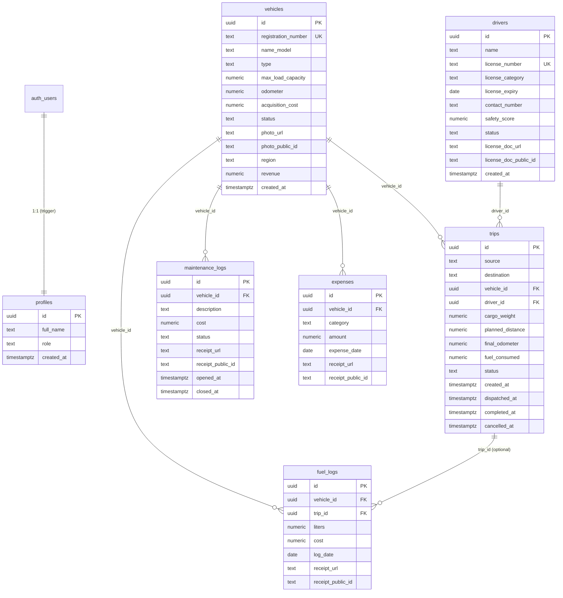

# TransitOps — Comprehensive Documentation

> **Version:** 1.0.0  
> **Last Updated:** 2026-07-12  
> **Stack:** React 19 · Vite 8 · TypeScript 6 · Supabase (Postgres + Auth + Edge Functions + Realtime) · Cloudinary · Tailwind CSS 3 · shadcn/ui (base-nova)

---

## Table of Contents

1. [Project Overview](#1-project-overview)
2. [Project Structure](#2-project-structure)
3. [Frontend Architecture](#3-frontend-architecture)
4. [Backend Architecture](#4-backend-architecture)
5. [Database Design](#5-database-design)
6. [Core Functionalities](#6-core-functionalities)
7. [Functions & Logic](#7-functions--logic)
8. [Integration & APIs](#8-integration--apis)
9. [Setup & Installation Guide](#9-setup--installation-guide)
10. [Scalability & Improvements](#10-scalability--improvements)

---

## 1. Project Overview

### 1.1 Purpose

**TransitOps** is a fleet management web application for transit and logistics companies. It provides a unified dashboard to manage vehicles, drivers, trips, maintenance, fuel/expenses, and financial reporting — all in one place.

The system is designed around a **Supabase-only backend** (no custom Node.js server). All business logic lives in **PostgreSQL RPC functions** and **Row Level Security (RLS) policies**, with a single **Supabase Edge Function** for Cloudinary upload signing. The React frontend talks directly to Supabase via its JavaScript client.

### 1.2 Key Features

| Feature | Description |
|---|---|
| **Role-Based Access Control (RBAC)** | Four roles (`fleet_manager`, `driver`, `safety_officer`, `financial_analyst`) with granular read/write permissions enforced at the database level. |
| **Vehicle Management** | Register vehicles with photos, track status (`AVAILABLE`, `ON_TRIP`, `IN_SHOP`, `RETIRED`), filter by type/status/region. |
| **Driver Management** | Maintain driver records, license compliance tracking, safety scores, expiry alerts. |
| **Trip Lifecycle** | Full state machine: `DRAFT → DISPATCHED → COMPLETED` or `→ CANCELLED`, with atomic RPC transitions that lock vehicles and drivers. |
| **Maintenance Tracking** | Open/close maintenance records via atomic RPCs that automatically transition vehicle status to/from `IN_SHOP`. |
| **Fuel & Expense Logging** | Log fuel consumption (optionally linked to trips), toll costs, and miscellaneous expenses with receipt uploads. |
| **Reports & Analytics** | Per-vehicle ROI analysis with interactive charts (Recharts), fuel efficiency comparisons, cost breakdowns, and CSV export. |
| **Real-Time Dashboard** | Supabase Realtime subscriptions push KPI updates when trip data changes. |
| **Dark Mode** | System-preference-aware theme toggle persisted to `localStorage`. |
| **Global Search** | Debounced search across vehicles and drivers from the top header. |
| **Image/PDF Upload** | Signed Cloudinary uploads for vehicle photos, license scans, and receipt documents. |

### 1.3 User Roles

| Role | Can Do | Cannot Do |
|---|---|---|
| `fleet_manager` | Everything: manage vehicles, trips, maintenance, fuel, expenses, reports | — |
| `driver` | View all data, create draft trips, log fuel | Manage vehicles, maintenance, reports |
| `safety_officer` | View all data, manage drivers (add/edit) | Manage vehicles, trips, maintenance, expenses |
| `financial_analyst` | View all data, log expenses | Manage vehicles, drivers, trips, maintenance |

---

## 2. Project Structure

```
TransitOps/
├── .env                          # Environment variables (Supabase + Cloudinary)
├── index.html                    # Vite HTML entry point
├── vite.config.ts                # Vite configuration with path aliases
├── tailwind.config.js            # Tailwind CSS 3 config (dark mode: 'class')
├── postcss.config.js             # PostCSS → Tailwind + Autoprefixer
├── tsconfig.json                 # Root TypeScript config (references app + node)
├── tsconfig.app.json             # App-level TS config (src/)
├── tsconfig.node.json            # Node-level TS config (vite.config.ts)
├── components.json               # shadcn/ui configuration (base-nova style)
├── package.json                  # Dependencies and scripts
├── supabase_schema.sql           # Complete database schema (idempotent)
├── seed_data.sql                 # Demo seed data (Indian transit fleet)
├── inject.js                     # One-off code-mod script (ErrorBanner injection)
│
├── src/
│   ├── main.tsx                  # React entry point (StrictMode + App)
│   ├── App.tsx                   # Router, providers, route definitions
│   ├── App.css                   # Legacy CSS (Vite scaffold, mostly unused)
│   ├── index.css                 # Tailwind base/components/utilities imports
│   │
│   ├── pages/                    # Route-level page components
│   │   ├── Login.tsx             # Authentication (sign-in + sign-up)
│   │   ├── Dashboard.tsx         # KPI cards with filters + realtime
│   │   ├── Vehicles.tsx          # Vehicle CRUD table + add modal
│   │   ├── Drivers.tsx           # Driver CRUD table + add modal
│   │   ├── Trips.tsx             # Trip lifecycle (create/dispatch/complete/cancel)
│   │   ├── Maintenance.tsx       # Open/close maintenance records
│   │   ├── FuelExpenses.tsx      # Fuel logs + expense logs (tabbed)
│   │   └── Reports.tsx           # Charts + ROI table + CSV export
│   │
│   ├── components/               # Shared components
│   │   ├── Layout.tsx            # Sidebar + header + search + theme toggle
│   │   ├── ProtectedRoute.tsx    # Auth guard (redirects to /login)
│   │   ├── ErrorBanner.tsx       # Dismissible error alert banner
│   │   ├── ImageUpload.tsx       # Cloudinary file upload with preview
│   │   └── ui/                   # shadcn/ui primitives (base-nova)
│   │       ├── badge.tsx
│   │       ├── button.tsx
│   │       ├── card.tsx
│   │       ├── dialog.tsx
│   │       ├── input.tsx
│   │       ├── label.tsx
│   │       ├── select.tsx
│   │       ├── table.tsx
│   │       └── tabs.tsx
│   │
│   ├── contexts/                 # React Context providers
│   │   ├── AuthContext.tsx        # User, session, role, signOut
│   │   └── ThemeContext.tsx       # Light/dark theme toggle
│   │
│   ├── hooks/                    # Custom React hooks
│   │   └── useSortableData.ts    # Generic client-side table sorting
│   │
│   ├── lib/                      # Utility libraries
│   │   ├── supabaseClient.ts     # Supabase client singleton
│   │   ├── cloudinary.ts         # Signed upload helper
│   │   └── utils.ts              # cn() utility (clsx + tailwind-merge)
│   │
│   └── assets/                   # Static assets (images, SVGs)
│
└── supabase/
    ├── config.toml               # Supabase local dev configuration
    └── functions/
        ├── _shared/
        │   └── cors.ts           # Shared CORS headers for Edge Functions
        └── sign-cloudinary/
            ├── index.ts          # Edge Function: Cloudinary signature generation
            ├── deno.json         # Deno import map
            └── .npmrc            # NPM config for Deno
```

### 2.1 Directory Descriptions

| Directory | Purpose |
|---|---|
| `src/pages/` | One file per route. Each page is a self-contained feature module with its own state, data fetching, forms, and modals. |
| `src/components/` | Shared, reusable components used across multiple pages. |
| `src/components/ui/` | shadcn/ui primitives — low-level, styled building blocks (Button, Card, Table, etc.). Generated via `npx shadcn@latest add`. |
| `src/contexts/` | React Context providers that wrap the entire app tree to share auth state and theme state. |
| `src/hooks/` | Custom React hooks for reusable logic (currently only table sorting). |
| `src/lib/` | Non-React utility modules — Supabase client initialization, Cloudinary helpers, CSS class merging. |
| `supabase/functions/` | Supabase Edge Functions (Deno runtime). Currently one function for Cloudinary upload signing. |

---

## 3. Frontend Architecture

### 3.1 Technology Stack

| Technology | Version | Purpose |
|---|---|---|
| React | 19.2.7 | UI framework |
| Vite | 8.1.1 | Build tool and dev server |
| TypeScript | 6.0.2 | Type safety |
| React Router DOM | 7.18.1 | Client-side routing |
| Tailwind CSS | 3.4.19 | Utility-first CSS |
| shadcn/ui (base-nova) | Latest | Pre-styled UI primitives |
| React Hook Form | 7.81.0 | Form state management |
| Zod | 4.4.3 | Schema validation |
| Recharts | 3.9.2 | Data visualization (charts) |
| Lucide React | 1.24.0 | Icon library |
| PapaParse | 5.5.4 | CSV export generation |
| @supabase/supabase-js | 2.110.2 | Supabase client SDK |

### 3.2 Pages and Routes

```
/login              → Login.tsx       (public)
/                   → Redirects to /dashboard
/dashboard          → Dashboard.tsx   (protected)
/vehicles           → Vehicles.tsx    (protected)
/drivers            → Drivers.tsx     (protected)
/trips              → Trips.tsx       (protected)
/maintenance        → Maintenance.tsx (protected, fleet_manager sidebar)
/fuel-expenses      → FuelExpenses.tsx(protected, fleet_manager sidebar)
/reports            → Reports.tsx     (protected, fleet_manager sidebar)
*                   → Redirects to /dashboard
```

**Route protection** is handled by `ProtectedRoute.tsx`, which wraps all authenticated routes. It checks `useAuth().user` — if `null`, it redirects to `/login`. All protected routes are nested inside `Layout.tsx`, which provides the sidebar + header chrome.

**Navigation visibility** is role-gated in `Layout.tsx`:
- Dashboard, Vehicles, Drivers, Trips → visible to `fleet_manager`, `driver`, `safety_officer`
- Maintenance, Fuel & Expenses, Reports → visible only to `fleet_manager`

### 3.3 Components

#### Core Components

| Component | File | Purpose | Props |
|---|---|---|---|
| `Layout` | `components/Layout.tsx` | App shell with sidebar navigation, global search, and theme toggle. Renders child routes via `<Outlet />`. | None (uses context hooks) |
| `ProtectedRoute` | `components/ProtectedRoute.tsx` | Auth guard that redirects unauthenticated users to `/login`. | None (uses `useAuth()`) |
| `ErrorBanner` | `components/ErrorBanner.tsx` | Displays a styled error alert with an icon. | `message: string \| null` — if `null`, renders nothing |
| `ImageUpload` | `components/ImageUpload.tsx` | Drag-and-drop file uploader with preview (images + PDFs), max 5MB, uploads to Cloudinary. | `folder: string`, `onUploaded: (data: {url, publicId}) => void`, `label?: string`, `defaultPreview?: string`, `className?: string` |

#### UI Primitives (shadcn/ui)

These are located in `src/components/ui/` and follow the shadcn/ui pattern using `@base-ui/react` primitives, `class-variance-authority` for variants, and `tailwind-merge` for className merging.

| Component | Variants / Notes |
|---|---|
| `Button` | Variants: `default`, `outline`, `secondary`, `ghost`, `destructive`, `link`. Sizes: `default`, `xs`, `sm`, `lg`, `icon`, `icon-*`. |
| `Badge` | Variants: `default`, `secondary`, `destructive`, `outline`. |
| `Card` | Sub-components: `Card`, `CardHeader`, `CardTitle`, `CardDescription`, `CardContent`, `CardFooter`. |
| `Dialog` | Sub-components: `Dialog`, `DialogContent`, `DialogHeader`, `DialogTitle`, `DialogFooter`, `DialogTrigger`. Uses `@radix-ui/react-dialog`. |
| `Input` | Standard input with focus ring styling. |
| `Label` | Styled label using `@radix-ui/react-label`. |
| `Select` | Sub-components: `Select`, `SelectTrigger`, `SelectValue`, `SelectContent`, `SelectItem`. Uses `@radix-ui/react-select`. |
| `Table` | Sub-components: `Table`, `TableHeader`, `TableBody`, `TableRow`, `TableHead`, `TableCell`. |
| `Tabs` | Sub-components: `Tabs`, `TabsList`, `TabsTrigger`, `TabsContent`. Uses `@radix-ui/react-tabs`. |

### 3.4 State Management and Data Flow

TransitOps uses **no global state library** (no Redux, Zustand, etc.). State is managed through:

1. **React Context** (app-wide state):
   - `AuthContext` → user session, role, loading state, `signOut()`
   - `ThemeContext` → current theme (`'light'` | `'dark'`), `toggleTheme()`

2. **Local component state** (page-level state):
   - Each page manages its own data via `useState` + `useEffect` + direct Supabase queries.
   - Form state is managed by **React Hook Form** with **Zod** validation schemas.

3. **Data flow pattern** (every page follows this pattern):

```
┌──────────────┐     fetch on mount      ┌───────────────┐
│   Page       │ ──────────────────────► │   Supabase    │
│  Component   │ ◄────────────────────── │   (Postgres)  │
│              │     data / error         │               │
│  useState()  │                          │   RLS Policy  │
│  useEffect() │     RPC / insert         │   enforced    │
│  useForm()   │ ──────────────────────► │               │
└──────────────┘                          └───────────────┘
```

Each page:
- Calls `supabase.from('table').select(...)` in a `useEffect` on mount
- Stores results in local state (`useState`)
- Renders a loading state, empty state, or data table
- Uses modals (Dialog) for create/edit forms
- Calls `supabase.from('table').insert(...)` or `supabase.rpc('function_name', {...})` for writes
- Re-fetches data after successful mutations

### 3.5 Theme System

The theme system uses Tailwind's `darkMode: 'class'` strategy:

1. `ThemeContext` reads the initial theme from `localStorage` → falls back to system preference (`prefers-color-scheme`) → falls back to `'light'`.
2. On change, it toggles the `dark` class on `<html>` and persists to `localStorage`.
3. All shadcn/ui components use CSS custom properties (`--background`, `--foreground`, `--primary`, etc.) that respond to the `.dark` class.

---

## 4. Backend Architecture

### 4.1 Overview

TransitOps has a **serverless backend** — there is no Express/Fastify/Next.js server. The entire backend consists of:

| Layer | Technology | Purpose |
|---|---|---|
| **Database** | Supabase Postgres | Data storage, business logic (RPC functions), access control (RLS) |
| **Authentication** | Supabase Auth | Email/password signup + login, JWT session management |
| **Realtime** | Supabase Realtime | WebSocket push for live KPI updates |
| **Edge Functions** | Supabase Edge Functions (Deno) | Cloudinary upload signature generation |
| **File Storage** | Cloudinary | Vehicle photos, license scans, receipts |

### 4.2 Supabase Client Configuration

**File:** `src/lib/supabaseClient.ts`

```typescript
import { createClient } from '@supabase/supabase-js'

const supabaseUrl = import.meta.env.VITE_SUPABASE_URL
const supabaseAnonKey = import.meta.env.VITE_SUPABASE_ANON_KEY

export const isSupabaseConfigured = Boolean(supabaseUrl && supabaseAnonKey)

export const supabase = createClient(
  supabaseUrl || 'https://placeholder.supabase.co',
  supabaseAnonKey || 'placeholder'
)
```

- The `isSupabaseConfigured` flag is checked in `App.tsx` — if env vars are missing, the app renders a configuration error screen instead of the routes.
- The placeholder fallback ensures `createClient` doesn't throw during build.

### 4.3 API Routes (Supabase Client Calls)

Since Supabase provides a REST API auto-generated from the schema, there are no hand-written API endpoints. The frontend calls Supabase directly:

#### 4.3.1 Authentication

| Action | Call | Example |
|---|---|---|
| **Sign Up** | `supabase.auth.signUp({email, password, options: {data: {full_name, role}}})` | Creates user in `auth.users` → trigger auto-creates `profiles` row |
| **Sign In** | `supabase.auth.signInWithPassword({email, password})` | Returns JWT session |
| **Sign Out** | `supabase.auth.signOut()` | Clears local session |
| **Get Session** | `supabase.auth.getSession()` | Returns current session if logged in |
| **Listen for Changes** | `supabase.auth.onAuthStateChange(callback)` | Fires on login/logout/token refresh |

**Request/Response Example — Sign Up:**

```javascript
// Request
const { data, error } = await supabase.auth.signUp({
  email: 'manager@example.com',
  password: 'securepassword123',
  options: {
    data: {
      full_name: 'Jane Doe',
      role: 'fleet_manager'
    }
  }
})

// Response (success)
{
  data: {
    user: { id: 'uuid-here', email: 'manager@example.com', ... },
    session: { access_token: 'jwt-token', ... }
  },
  error: null
}
```

#### 4.3.2 CRUD Operations

| Resource | Read | Create | Update | Notes |
|---|---|---|---|---|
| `vehicles` | `.from('vehicles').select('*')` | `.from('vehicles').insert({...})` | `.from('vehicles').update({...}).eq('id', id)` | Status changes only via RPCs |
| `drivers` | `.from('drivers').select('*')` | `.from('drivers').insert({...})` | `.from('drivers').update({...}).eq('id', id)` | Status changes only via RPCs |
| `trips` | `.from('trips').select('*, vehicles(...), drivers(...)')` | `.from('trips').insert({...})` | Not allowed directly | All transitions via RPCs |
| `maintenance_logs` | `.from('maintenance_logs').select('*, vehicles(...)')` | Via `open_maintenance` RPC | Via `close_maintenance` RPC | Never directly inserted/updated |
| `fuel_logs` | `.from('fuel_logs').select('*, vehicles(...), trips(...)')` | `.from('fuel_logs').insert({...})` | — | Insert only |
| `expenses` | `.from('expenses').select('*, vehicles(...)')` | `.from('expenses').insert({...})` | — | Insert only |
| `profiles` | `.from('profiles').select('role').eq('id', userId)` | Auto-created by trigger | `.from('profiles').update({...}).eq('id', userId)` | Users can only update own row |

**Request/Response Example — Fetch Vehicles with Filters:**

```javascript
// Request
let query = supabase
  .from('vehicles')
  .select('*')
  .order('created_at', { ascending: false })

if (filterType) query = query.eq('type', filterType)
if (filterStatus && filterStatus !== 'ALL') query = query.eq('status', filterStatus)
if (filterRegion) query = query.eq('region', filterRegion)

const { data, error } = await query

// Response (success) — array of vehicle objects
{
  data: [
    {
      id: "a1000000-...-000000000001",
      registration_number: "MH-12-AB-1234",
      name_model: "Tata Prima 4928.S",
      type: "Truck",
      max_load_capacity: 28000,
      odometer: 124500,
      acquisition_cost: 2800000,
      status: "AVAILABLE",
      photo_url: "https://res.cloudinary.com/...",
      photo_public_id: "transitops/vehicles/abc123",
      region: "Maharashtra",
      revenue: 1850000,
      created_at: "2026-07-01T10:00:00Z"
    },
    ...
  ],
  error: null
}
```

#### 4.3.3 RPC Functions

All state-changing business logic goes through these atomic RPC functions:

| RPC | Parameters | Called From | What It Does |
|---|---|---|---|
| `dispatch_trip` | `p_trip_id: uuid` | Trips page → "Dispatch" button | Validates vehicle/driver availability + license + cargo capacity → sets trip to `DISPATCHED`, vehicle/driver to `ON_TRIP` |
| `complete_trip` | `p_trip_id: uuid, p_final_odometer: numeric, p_fuel_consumed: numeric` | Trips page → "Complete" modal | Sets trip to `COMPLETED`, updates vehicle odometer, releases vehicle/driver back to `AVAILABLE` |
| `cancel_trip` | `p_trip_id: uuid` | Trips page → "Cancel" button | Sets trip to `CANCELLED`, releases vehicle/driver if was `DISPATCHED` |
| `open_maintenance` | `p_vehicle_id: uuid, p_description: text, p_receipt_url?: text, p_receipt_public_id?: text` | Maintenance page → "Open Record" modal | Creates maintenance log, sets vehicle to `IN_SHOP` (rejects if vehicle is `ON_TRIP` or `RETIRED`) |
| `close_maintenance` | `p_log_id: uuid, p_cost: numeric` | Maintenance page → "Close" button | Closes maintenance log with final cost, returns vehicle to `AVAILABLE` (unless `RETIRED`) |

**Request/Response Example — Dispatch Trip:**

```javascript
// Request
const { error } = await supabase.rpc('dispatch_trip', {
  p_trip_id: 'c1000000-0000-0000-0000-000000000007'
})

// Success: error is null, trip status is now DISPATCHED

// Failure examples:
// error.message contains 'VEHICLE_NOT_AVAILABLE' → vehicle was already on a trip
// error.message contains 'DRIVER_LICENSE_EXPIRED' → driver's license is past expiry
// error.message contains 'CARGO_EXCEEDS_CAPACITY' → cargo_weight > vehicle's max_load_capacity
```

#### 4.3.4 Views (Read-Only)

| View | Purpose | Called From |
|---|---|---|
| `v_fleet_kpis` | Dashboard KPIs: active/available/in-maintenance vehicles, active/pending trips, drivers on duty, fleet utilization % | Dashboard page (unfiltered mode) |
| `v_vehicle_operational_cost` | Per-vehicle cost breakdown: fuel, maintenance, expenses, total operational cost, ROI | Available but Reports page computes client-side for interactivity |

#### 4.3.5 Realtime Subscriptions

```javascript
// Dashboard.tsx subscribes to all changes on the trips table
const channel = supabase.channel('public:trips')
  .on(
    'postgres_changes',
    { event: '*', schema: 'public', table: 'trips' },
    (payload) => {
      fetchKpis()  // Re-fetch KPIs whenever any trip row changes
    }
  )
  .subscribe()

// Cleanup on unmount
return () => supabase.removeChannel(channel)
```

### 4.4 Edge Functions

**Only one Edge Function exists:** `sign-cloudinary`

**File:** `supabase/functions/sign-cloudinary/index.ts`

**Purpose:** Generates a SHA-1 signature for secure Cloudinary uploads. The API secret never leaves the server — only the signature and timestamp are returned to the client.

**Flow:**
```
Client                          Edge Function                    Cloudinary
  │                                  │                               │
  │ POST {folder: "transitops/..."}  │                               │
  │ ─────────────────────────────►   │                               │
  │                                  │ Reads CLOUDINARY_API_SECRET    │
  │                                  │ Reads CLOUDINARY_API_KEY       │
  │                                  │ Computes SHA-1 signature       │
  │ {signature, timestamp, api_key}  │                               │
  │ ◄─────────────────────────────   │                               │
  │                                  │                               │
  │ POST multipart/form-data                                         │
  │ (file + signature + timestamp + api_key)                         │
  │ ────────────────────────────────────────────────────────────────► │
  │                                                                  │
  │ {secure_url, public_id}                                          │
  │ ◄──────────────────────────────────────────────────────────────── │
```

**Request:**
```json
POST /functions/v1/sign-cloudinary
Authorization: Bearer <supabase-jwt>
Content-Type: application/json

{ "folder": "transitops/vehicles" }
```

**Response:**
```json
{
  "signature": "a1b2c3d4e5f6...",
  "timestamp": "1720800000",
  "api_key": "123456789012345"
}
```

**CORS:** The `_shared/cors.ts` module exports headers allowing any origin (`Access-Control-Allow-Origin: *`).

### 4.5 Middleware (RLS as Middleware)

Since there's no traditional server, **Row Level Security (RLS) acts as middleware**. Every query passes through RLS policies before returning data. The policies are:

| Table | SELECT | INSERT | UPDATE | DELETE |
|---|---|---|---|---|
| `profiles` | All authenticated | Auto (trigger) | Own row only | — |
| `vehicles` | All authenticated | `fleet_manager` | `fleet_manager` (non-status columns) | `fleet_manager` |
| `drivers` | All authenticated | `safety_officer` | `safety_officer` (non-status columns) | `safety_officer` |
| `trips` | All authenticated | `driver`, `fleet_manager` | Via RPCs only | Via RPCs only |
| `maintenance_logs` | All authenticated | `fleet_manager` | Via RPCs only | — |
| `fuel_logs` | All authenticated | `fleet_manager`, `driver` | — | — |
| `expenses` | All authenticated | `fleet_manager`, `financial_analyst` | — | — |

The helper function `current_role_name()` queries the `profiles` table for the current user's role and is used in all RLS policies:

```sql
CREATE OR REPLACE FUNCTION current_role_name()
RETURNS text AS $$
  SELECT role FROM profiles WHERE id = auth.uid();
$$ LANGUAGE sql STABLE SECURITY DEFINER;
```

---

## 5. Database Design

### 5.1 Entity-Relationship Diagram



### 5.2 Table Details

#### `profiles`
Extends `auth.users` with application-specific metadata. Created automatically on signup via a PostgreSQL trigger (`handle_new_user`).

- **PK:** `id` (references `auth.users(id)` with `ON DELETE CASCADE`)
- **Constraints:** `role` must be one of `'fleet_manager'`, `'driver'`, `'safety_officer'`, `'financial_analyst'`

#### `vehicles`
Fleet inventory. Each vehicle has a lifecycle status managed exclusively by RPC functions.

- **PK:** `id` (UUID, auto-generated)
- **Unique:** `registration_number`
- **Status values:** `AVAILABLE`, `ON_TRIP`, `IN_SHOP`, `RETIRED`
- **Constraints:** `max_load_capacity > 0`, `odometer >= 0`, `acquisition_cost >= 0`

#### `drivers`
Driver registry with license compliance tracking.

- **PK:** `id` (UUID, auto-generated)
- **Unique:** `license_number`
- **Status values:** `AVAILABLE`, `ON_TRIP`, `OFF_DUTY`, `SUSPENDED`
- **Constraints:** `safety_score` between 0 and 100

#### `trips`
Core operational entity tracking cargo movements.

- **PK:** `id` (UUID, auto-generated)
- **FKs:** `vehicle_id → vehicles(id)`, `driver_id → drivers(id)`
- **Status values:** `DRAFT`, `DISPATCHED`, `COMPLETED`, `CANCELLED`
- **Constraints:** `cargo_weight > 0`

#### `maintenance_logs`
Repair and service records linked to vehicles.

- **PK:** `id` (UUID, auto-generated)
- **FK:** `vehicle_id → vehicles(id)`
- **Status values:** `OPEN`, `CLOSED`
- **Constraints:** `cost >= 0`

#### `fuel_logs`
Fuel consumption records, optionally linked to a trip.

- **PK:** `id` (UUID, auto-generated)
- **FKs:** `vehicle_id → vehicles(id)`, `trip_id → trips(id)` (nullable)
- **Constraints:** `liters > 0`, `cost >= 0`

#### `expenses`
Tolls, ad-hoc maintenance, and other costs.

- **PK:** `id` (UUID, auto-generated)
- **FK:** `vehicle_id → vehicles(id)`
- **Category values:** `'toll'`, `'maintenance'`, `'other'`
- **Constraints:** `amount >= 0`

### 5.3 Indexes

```sql
-- Frequently filtered columns
CREATE INDEX idx_vehicles_status      ON vehicles(status);
CREATE INDEX idx_vehicles_type        ON vehicles(type);
CREATE INDEX idx_vehicles_region      ON vehicles(region);
CREATE INDEX idx_drivers_status       ON drivers(status);
CREATE INDEX idx_drivers_license_expiry ON drivers(license_expiry);
CREATE INDEX idx_trips_status         ON trips(status);
CREATE INDEX idx_trips_vehicle_id     ON trips(vehicle_id);
CREATE INDEX idx_trips_driver_id      ON trips(driver_id);
CREATE INDEX idx_maintenance_vehicle_id ON maintenance_logs(vehicle_id);
CREATE INDEX idx_maintenance_status   ON maintenance_logs(status);
CREATE INDEX idx_fuel_vehicle_id      ON fuel_logs(vehicle_id);
CREATE INDEX idx_expenses_vehicle_id  ON expenses(vehicle_id);
```

### 5.4 Views

#### `v_fleet_kpis`
Aggregates vehicle/trip/driver counts into a single row for the dashboard.

| Column | Type | Description |
|---|---|---|
| `active_vehicles` | int | Vehicles not `RETIRED` |
| `available_vehicles` | int | Vehicles with status `AVAILABLE` |
| `vehicles_in_maintenance` | int | Vehicles with status `IN_SHOP` |
| `active_trips` | int | Trips with status `DISPATCHED` |
| `pending_trips` | int | Trips with status `DRAFT` |
| `drivers_on_duty` | int | Drivers with status `ON_TRIP` |
| `fleet_utilization_pct` | numeric | `(ON_TRIP vehicles / non-RETIRED vehicles) × 100` |

#### `v_vehicle_operational_cost`
Per-vehicle cost aggregation with ROI calculation.

| Column | Type | Description |
|---|---|---|
| `vehicle_id` | uuid | Vehicle FK |
| `registration_number` | text | Display key |
| `acquisition_cost` | numeric | Original purchase price |
| `revenue` | numeric | Revenue field from vehicles table |
| `total_fuel_cost` | numeric | Sum of `fuel_logs.cost` |
| `total_liters` | numeric | Sum of `fuel_logs.liters` |
| `total_maintenance_cost` | numeric | Sum of `maintenance_logs.cost` (closed only) |
| `total_expense_cost` | numeric | Sum of `expenses.amount` |
| `total_operational_cost` | numeric | Fuel + maintenance + expenses |
| `roi` | numeric | `(revenue - (maintenance + fuel)) / acquisition_cost` |

---

## 6. Core Functionalities

### 6.1 User Authentication Flow

```
┌─────────────┐     signUp/signIn      ┌────────────────┐     trigger      ┌──────────┐
│  Login.tsx   │ ─────────────────────► │  Supabase Auth │ ──────────────► │ profiles │
│             │ ◄───────────────────── │                │ (auto-insert)  │ (new row)│
│  Form state  │   JWT session / error  │  auth.users    │                  └──────────┘
└──────────────┘                        └────────────────┘
       │
       │ navigate('/dashboard')
       ▼
┌──────────────┐
│ AuthContext   │ ← getSession() + onAuthStateChange()
│              │ ← fetchRole(userId) → profiles.select('role')
│ Provides:    │
│  user        │
│  session     │
│  role        │
│  loading     │
│  signOut()   │
└──────────────┘
```

**Step-by-step:**

1. User navigates to `/login` — `Login.tsx` renders a card with email/password fields.
2. **Sign Up mode** (toggle): Also shows Full Name and Role selector.
3. On submit:
   - **Sign In:** Calls `supabase.auth.signInWithPassword({email, password})`.
   - **Sign Up:** Calls `supabase.auth.signUp({email, password, options: {data: {full_name, role}}})`.
4. On success → `navigate('/dashboard')`.
5. `AuthContext` detects the session change via `onAuthStateChange` → fetches the user's `role` from `profiles` → stores in context.
6. `ProtectedRoute` allows rendering child routes since `user` is now non-null.
7. `Layout.tsx` renders sidebar nav items filtered by `role`.

### 6.2 Trip Lifecycle (State Machine)

```
  ┌─────────┐    dispatch_trip()     ┌─────────────┐    complete_trip()    ┌───────────┐
  │  DRAFT  │ ─────────────────────► │ DISPATCHED  │ ────────────────────► │ COMPLETED │
  └─────────┘                        └─────────────┘                       └───────────┘
       │                                   │
       │    cancel_trip()                  │   cancel_trip()
       ▼                                   ▼
  ┌───────────┐                       ┌───────────┐
  │ CANCELLED │                       │ CANCELLED │
  └───────────┘                       └───────────┘
```

**Step-by-step — Creating and Dispatching a Trip:**

1. **Create Draft:** User clicks "New Trip" on `Trips.tsx`.
   - Modal opens → fetches available vehicles (`status = 'AVAILABLE'`) and drivers (`status = 'AVAILABLE'` with valid license).
   - User fills source, destination, selects vehicle/driver, enters cargo weight and distance.
   - Frontend validates cargo weight against `vehicle.max_load_capacity` (visual warning).
   - On submit: `supabase.from('trips').insert({...data, status: 'DRAFT'})`.
   - RLS policy allows insert for `driver` and `fleet_manager` roles.

2. **Dispatch:** User clicks "Dispatch" on a DRAFT row.
   - Calls `supabase.rpc('dispatch_trip', {p_trip_id: tripId})`.
   - The RPC function (runs as SECURITY DEFINER):
     - Locks the trip row with `FOR UPDATE`.
     - Validates: trip is `DRAFT`, vehicle is `AVAILABLE`, driver is `AVAILABLE`, license not expired, cargo within capacity.
     - Updates trip to `DISPATCHED`, vehicle to `ON_TRIP`, driver to `ON_TRIP`.
     - All in one transaction — if any check fails, the entire operation rolls back.

3. **Complete:** User clicks "Complete" on a DISPATCHED row.
   - Modal asks for final odometer and fuel consumed.
   - Calls `supabase.rpc('complete_trip', {p_trip_id, p_final_odometer, p_fuel_consumed})`.
   - The RPC: validates trip is `DISPATCHED`, updates trip to `COMPLETED`, updates vehicle odometer, releases vehicle/driver to `AVAILABLE`.

4. **Cancel:** User clicks "Cancel" on a DRAFT or DISPATCHED row.
   - Confirms via `window.confirm()`.
   - Calls `supabase.rpc('cancel_trip', {p_trip_id})`.
   - The RPC: if was `DISPATCHED`, releases vehicle/driver back to `AVAILABLE`.

### 6.3 Maintenance Lifecycle

```
  open_maintenance()          close_maintenance()
  ─────────────────►  OPEN  ─────────────────────►  CLOSED
                     Vehicle                        Vehicle
                     → IN_SHOP                      → AVAILABLE
```

**Step-by-step:**

1. **Open:** Fleet manager clicks "Open Record" on `Maintenance.tsx`.
   - Fetches eligible vehicles (excludes `RETIRED`).
   - User selects vehicle, describes the issue, optionally uploads a receipt/quotation.
   - Calls `supabase.rpc('open_maintenance', {p_vehicle_id, p_description, ...})`.
   - The RPC: validates vehicle is not `ON_TRIP` or `RETIRED`, creates a maintenance log row, sets vehicle status to `IN_SHOP`.
   - A banner confirms: "Maintenance opened. {registration} status changed to IN SHOP."

2. **Close:** Fleet manager clicks "Close" on an OPEN record.
   - Modal asks for final cost.
   - Calls `supabase.rpc('close_maintenance', {p_log_id, p_cost})`.
   - The RPC: closes the log with cost and timestamp, returns vehicle to `AVAILABLE` (unless `RETIRED`).
   - A banner confirms: "Maintenance closed. Vehicle status returned to AVAILABLE."

### 6.4 Vehicle CRUD

1. **Read:** `Vehicles.tsx` fetches all vehicles with filters (status, type, region). Results are displayed in a sortable table with photo thumbnails (via Cloudinary transformations: `w_200,h_150,c_fill,q_auto,f_auto`).

2. **Create:** Fleet managers see an "Add Vehicle" button → Dialog with Zod-validated form:
   - Fields: registration number, model name, type, region, max load capacity, acquisition cost
   - Optional photo upload via `ImageUpload` component
   - On submit: inserts with `status: 'AVAILABLE'`, `odometer: 0`
   - Duplicate registration error (code `23505`) is caught and displayed as a friendly message.

3. **Update/Delete:** Status changes happen indirectly through trip dispatch/complete and maintenance open/close RPCs. Direct column updates (model, type, capacity, region, etc.) are permitted for fleet managers but not yet exposed in the UI.

### 6.5 Fuel & Expense Logging

The `FuelExpenses.tsx` page uses a **tabbed interface**:

- **Fuel Logs tab:** Records fuel fills per vehicle, optionally linked to a trip. Shows date, vehicle, liters, cost, linked trip, and receipt link.
- **Other Expenses tab:** Records tolls, ad-hoc maintenance, and miscellaneous costs. Categories: `toll`, `maintenance`, `other`.

Above both tabs, a **Vehicle Lifetime Cost** card shows a horizontally scrollable list of all vehicles sorted by total cost (fuel + expenses + maintenance).

### 6.6 Reports & Analytics

`Reports.tsx` provides:

1. **Fuel Efficiency Chart** (Bar chart): km/L per vehicle, calculated as `total_planned_distance / total_fuel_liters`.
2. **Operational Cost Breakdown** (Stacked bar chart): Per vehicle, broken down by fuel cost, maintenance cost, and other expenses.
3. **ROI Analysis Table:** Per vehicle with:
   - Acquisition cost
   - Total operational cost
   - Editable "Assumed Revenue" input (client-side, not persisted)
   - Computed ROI: `((Revenue - Total Ops Cost) / Acquisition Cost) × 100%`
4. **CSV Export:** Exports the ROI table using PapaParse's `unparse()`.

### 6.7 Global Search

**Location:** `Layout.tsx` header

**Behavior:**
1. User types into the search input (minimum 2 characters).
2. A 300ms debounce timer fires.
3. Parallel queries search `vehicles.registration_number` and `drivers.name` using `ilike('%query%')`, limited to 3 results each.
4. Results appear in a dropdown below the search input with type labels (`vehicle` / `driver`).
5. Clicking a result navigates to the relevant page (`/vehicles` or `/drivers`) and clears the search.

---

## 7. Functions & Logic

### 7.1 Important Frontend Functions

#### `uploadToCloudinary(file, folder)` — `lib/cloudinary.ts`

**Purpose:** Securely upload files to Cloudinary using signed uploads.

**Flow:**
1. Invokes the `sign-cloudinary` Edge Function to get a `{signature, timestamp, api_key}`.
2. Constructs a `FormData` with the file, signature, timestamp, api_key, and folder.
3. POSTs to `https://api.cloudinary.com/v1_1/{cloudName}/auto/upload`.
4. Returns `{url: secure_url, publicId: public_id}`.

**Error handling:** Throws on missing cloud name env var, signature failure, or Cloudinary upload failure.

#### `useSortableData<T>(items, config)` — `hooks/useSortableData.ts`

**Purpose:** Generic hook for client-side table column sorting.

**API:**
```typescript
const { items, requestSort, sortConfig } = useSortableData(vehicles)
// items: sorted array
// requestSort('column_name'): toggles asc/desc on that column
// sortConfig: { key: string, direction: 'asc' | 'desc' } | null
```

**Logic:**
- Maintains sort state (`key` + `direction`).
- `requestSort(key)`: if already sorting by `key` in `asc`, switches to `desc`; otherwise defaults to `asc`.
- Uses `useMemo` to avoid re-sorting on every render.

#### `cn(...inputs)` — `lib/utils.ts`

**Purpose:** Merges Tailwind CSS class names with conflict resolution.

```typescript
import { clsx } from 'clsx'
import { twMerge } from 'tailwind-merge'

export function cn(...inputs: ClassValue[]) {
  return twMerge(clsx(inputs))
}
```

Used extensively in shadcn/ui components to merge default variant classes with user-provided `className` props.

#### `mapRpcError(errMsg)` — `Trips.tsx`

**Purpose:** Translates database-level error codes from RPC functions into user-friendly messages.

```typescript
const mapRpcError = (errMsg: string) => {
  if (errMsg.includes('VEHICLE_NOT_AVAILABLE')) return 'Vehicle no longer available'
  if (errMsg.includes('DRIVER_NOT_AVAILABLE'))  return 'Driver no longer available'
  if (errMsg.includes('DRIVER_LICENSE_EXPIRED')) return "Driver's license is expired"
  if (errMsg.includes('CARGO_EXCEEDS_CAPACITY')) return 'Cargo weight exceeds vehicle capacity'
  if (errMsg.includes('TRIP_NOT_DISPATCHED'))    return 'Trip is not in dispatched state'
  return errMsg
}
```

#### `computeManualKpis(applyFilters)` — `Dashboard.tsx`

**Purpose:** When the user applies filters (type, status, region), the `v_fleet_kpis` view can't be filtered (it aggregates all data). This function manually queries vehicles, trips, and drivers and computes the same KPIs client-side, filtering vehicles first and then counting relevant trips.

### 7.2 Important Database Functions

#### `handle_new_user()` — Trigger Function

**Fires:** `AFTER INSERT ON auth.users`

**Purpose:** Auto-creates a `profiles` row using the `raw_user_meta_data` passed during `signUp()`. Falls back to `'Unnamed User'` and `'driver'` if metadata is missing.

#### `current_role_name()` — Helper Function

**Purpose:** Returns the current authenticated user's role by querying `profiles`. Marked as `STABLE SECURITY DEFINER` for efficient use in RLS policies.

#### `dispatch_trip(p_trip_id)` — RPC

**Validations:**
1. Trip exists and is `DRAFT`
2. Vehicle exists and is `AVAILABLE`
3. Driver exists and is `AVAILABLE`
4. Driver's license hasn't expired
5. Cargo weight ≤ vehicle's `max_load_capacity`

**Side effects:** Sets trip `DISPATCHED`, vehicle `ON_TRIP`, driver `ON_TRIP`. All rows locked with `FOR UPDATE` to prevent race conditions.

#### `complete_trip(p_trip_id, p_final_odometer, p_fuel_consumed)` — RPC

**Validations:** Trip is `DISPATCHED`, odometer is valid.

**Side effects:** Sets trip `COMPLETED` with timestamps, updates vehicle odometer, releases vehicle/driver to `AVAILABLE`.

#### `open_maintenance(p_vehicle_id, p_description, ...)` — RPC

**Validations:** Vehicle not `ON_TRIP` or `RETIRED`.

**Side effects:** Creates maintenance log, sets vehicle to `IN_SHOP`. Returns the new log's UUID.

#### `close_maintenance(p_log_id, p_cost)` — RPC

**Validations:** Maintenance log is `OPEN`, cost is valid.

**Side effects:** Closes log with cost + timestamp, returns vehicle to `AVAILABLE` (unless `RETIRED`).

### 7.3 Column-Level Security

Beyond RLS policies, the schema uses **PostgreSQL column-level GRANT/REVOKE** to prevent direct status column updates:

```sql
-- Vehicles: only non-status columns can be updated directly
REVOKE UPDATE ON vehicles FROM authenticated;
GRANT UPDATE (name_model, type, max_load_capacity, odometer, acquisition_cost,
              region, photo_url, photo_public_id, revenue)
  ON vehicles TO authenticated;

-- Drivers: status/license_number locked
REVOKE UPDATE ON drivers FROM authenticated;
GRANT UPDATE (name, license_category, license_expiry, contact_number,
              safety_score, license_doc_url, license_doc_public_id)
  ON drivers TO authenticated;

-- Trips: no direct UPDATE or DELETE allowed
REVOKE UPDATE, DELETE ON trips FROM authenticated;

-- Maintenance: only description can be updated directly
REVOKE UPDATE ON maintenance_logs FROM authenticated;
GRANT UPDATE (description) ON maintenance_logs TO authenticated;
```

Status columns are only ever changed by the `SECURITY DEFINER` RPC functions, which bypass these column-level restrictions.

---

## 8. Integration & APIs

### 8.1 Supabase

| Feature | Usage |
|---|---|
| **Auth** | Email/password authentication, JWT sessions, user metadata for role assignment |
| **Database (Postgres)** | All data storage, RPC functions for business logic, RLS for access control |
| **Realtime** | WebSocket subscription on `trips` table for live dashboard updates |
| **Edge Functions** | Cloudinary upload signature generation (Deno runtime) |
| **PostgREST** | Auto-generated REST API for CRUD operations (used via `supabase-js` client) |

### 8.2 Cloudinary

| Feature | Usage |
|---|---|
| **Image Upload** | Vehicle photos, driver license scans, maintenance/fuel/expense receipts |
| **Auto Upload** | Uses `/auto/upload` endpoint (auto-detects resource type: image, PDF, etc.) |
| **Signed Uploads** | API secret stays on server (Edge Function), client sends signature |
| **Transformations** | Thumbnail URLs generated client-side: `w_200,h_150,c_fill,q_auto,f_auto` |
| **Folders** | Organized as `transitops/vehicles`, `transitops/drivers`, `transitops/maintenance`, `transitops/receipts` |

### 8.3 Environment Variables

| Variable | Where Used | Description |
|---|---|---|
| `VITE_SUPABASE_URL` | Frontend (`supabaseClient.ts`) | Supabase project URL |
| `VITE_SUPABASE_ANON_KEY` | Frontend (`supabaseClient.ts`) | Supabase anonymous/public key |
| `VITE_CLOUDINARY_CLOUD_NAME` | Frontend (`cloudinary.ts`, `Vehicles.tsx`) | Cloudinary cloud name for upload URL and thumbnail generation |
| `CLOUDINARY_API_KEY` | Edge Function (`sign-cloudinary`) | Cloudinary API key (set in Supabase Dashboard → Edge Functions → Secrets) |
| `CLOUDINARY_API_SECRET` | Edge Function (`sign-cloudinary`) | Cloudinary API secret (set in Supabase Dashboard → Edge Functions → Secrets) |

> **Security Note:** `VITE_` prefixed variables are exposed to the browser. Only public keys should use this prefix. The Cloudinary API secret is kept server-side in the Edge Function environment.

---

## 9. Setup & Installation Guide

### 9.1 Prerequisites

| Tool | Version | Purpose |
|---|---|---|
| **Node.js** | 18+ (LTS recommended) | JavaScript runtime |
| **npm** | 9+ (ships with Node) | Package manager |
| **Git** | Latest | Version control |
| **Supabase Account** | Free tier works | Backend (database, auth, edge functions) |
| **Cloudinary Account** | Free tier works | Image/file storage |
| **Supabase CLI** | Latest (optional) | For deploying Edge Functions and local development |

### 9.2 Step-by-Step Setup

#### Step 1: Clone the Repository

```bash
git clone <repository-url>
cd TransitOps
```

#### Step 2: Install Dependencies

```bash
npm install
```

#### Step 3: Create a Supabase Project

1. Go to [supabase.com](https://supabase.com) and create a new project.
2. Note down:
   - **Project URL** (e.g., `https://abcdefgh.supabase.co`)
   - **Anon Key** (Project Settings → API → anon public)

#### Step 4: Set Up the Database Schema

1. In your Supabase project, go to **SQL Editor → New Query**.
2. Copy the entire contents of `supabase_schema.sql` and run it.
3. This creates all tables, indexes, triggers, RLS policies, RPC functions, and views.

#### Step 5: (Optional) Load Seed Data

1. In SQL Editor, run the contents of `seed_data.sql`.
2. This populates the database with realistic demo data (8 vehicles, 6 drivers, 10 trips, etc.).

> **Note:** The seed data inserts directly into tables and assumes no existing data. The profiles for seed drivers are NOT created — you'll need to sign up as real users.

#### Step 6: Set Up Cloudinary

1. Create a free [Cloudinary](https://cloudinary.com) account.
2. Note down:
   - **Cloud Name** (Dashboard → Account Details)
   - **API Key** (Dashboard → Account Details)
   - **API Secret** (Dashboard → Account Details)

#### Step 7: Configure Environment Variables

Create or update the `.env` file in the project root:

```env
VITE_SUPABASE_URL=https://your-project.supabase.co
VITE_SUPABASE_ANON_KEY=your-supabase-anon-key
VITE_CLOUDINARY_CLOUD_NAME=your-cloud-name
```

#### Step 8: Deploy the Edge Function

```bash
# Install the Supabase CLI
npm install -g supabase

# Login
supabase login

# Link to your project
supabase link --project-ref your-project-ref

# Set Edge Function secrets
supabase secrets set CLOUDINARY_API_KEY=your-api-key
supabase secrets set CLOUDINARY_API_SECRET=your-api-secret

# Deploy the Edge Function
supabase functions deploy sign-cloudinary
```

#### Step 9: Enable Realtime (Optional)

In Supabase Dashboard:
1. Go to **Database → Replication**.
2. Enable replication for the `trips` table (at minimum) to enable live dashboard updates.

#### Step 10: Start the Development Server

```bash
npm run dev
```

The app will be available at `http://localhost:5173`.

#### Step 11: Create Your First User

1. Navigate to `http://localhost:5173/login`.
2. Click "Don't have an account? Sign up".
3. Fill in your name, email, password, and select `fleet_manager` as the role.
4. Click "Sign up" — you'll be redirected to the dashboard.

### 9.3 Available Scripts

| Script | Command | Purpose |
|---|---|---|
| `dev` | `npm run dev` | Start Vite dev server with HMR |
| `build` | `npm run build` | Type-check + production build |
| `preview` | `npm run preview` | Preview the production build locally |
| `lint` | `npm run lint` | Run OxLint for code quality checks |

---

## 10. Scalability & Improvements

### 10.1 Current Limitations

| Area | Limitation |
|---|---|
| **Pagination** | Tables fetch all rows — no server-side pagination |
| **Editing** | No edit forms for vehicles/drivers (only create + read) |
| **Soft Delete** | No delete or archive functionality for any entity |
| **Mobile** | Layout is desktop-first; sidebar doesn't collapse on mobile |
| **Search** | Only searches vehicles (registration) and drivers (name); no trip/maintenance search |
| **Notifications** | No in-app notifications for events (e.g., license expiring) |
| **Tests** | No unit or integration tests |
| **File Cleanup** | Uploaded files on Cloudinary are never cleaned up when records are deleted |

### 10.2 Recommended Improvements

#### Performance & Data

- **Server-side Pagination:** Use Supabase `.range(from, to)` for all table queries. Add page controls to the UI. Critical when vehicle/trip counts grow to thousands.
- **Debounce Filter Queries:** Dashboard and Vehicle filters fire on every keystroke. Add debouncing (already done for search).
- **Optimistic Updates:** After mutations, update local state immediately and revalidate in the background instead of re-fetching the entire table.
- **Cache with SWR or React Query:** Replace raw `useEffect` fetching with a data-fetching library that handles caching, revalidation, and deduplication.

#### Features

- **Edit Forms:** Add in-place editing or edit modals for vehicles and drivers.
- **Soft Delete / Archive:** Add a `deleted_at` column and filter it out in queries.
- **Driver Suspension RPC:** Create a `suspend_driver(p_driver_id)` RPC for safety officers.
- **Notification System:** Track license expiry warnings (< 30 days) and surface them on the dashboard.
- **Trip Route Tracking:** Integrate a mapping library (Mapbox, Leaflet) for route visualization.
- **Audit Log:** Track who changed what and when using a separate `audit_log` table.
- **Revenue Tracking:** Persist the revenue values entered on the Reports page (currently only in-memory).

#### Architecture & Code Quality

- **State Management:** As the app grows, consider Zustand or Jotai for shared page-level state.
- **API Layer Abstraction:** Create a `services/` directory with functions like `vehicleService.getAll()`, `tripService.dispatch()` to decouple pages from raw Supabase calls.
- **Error Handling:** Implement a global error boundary (`react-error-boundary`) and consistent toast notifications instead of `alert()`.
- **Testing:** Add Vitest for unit tests, Playwright for E2E tests. Test the RPC functions using Supabase's pgTAP extension.
- **Mobile Responsiveness:** Add a collapsible sidebar (hamburger menu) for mobile viewports.
- **TypeScript Strictness:** Replace `any[]` state types with proper interfaces generated from the Supabase schema (`supabase gen types typescript`).
- **Code Splitting:** Use `React.lazy()` + `Suspense` for route-level code splitting to reduce initial bundle size.

#### Security

- **Role-Based UI Enforcement:** While RLS enforces access at the database level, the frontend should also disable/hide buttons based on role (partially done — can be more thorough).
- **Rate Limiting:** Add rate limiting on the Edge Function to prevent abuse.
- **Input Sanitization:** The `ilike` search query should escape special PostgreSQL characters (`%`, `_`, `\`).
- **CORS Lockdown:** Replace `Access-Control-Allow-Origin: *` in the Edge Function with your specific domain in production.
- **CSP Headers:** Add Content Security Policy headers in your hosting configuration.

#### Deployment

- **CI/CD:** Set up GitHub Actions to run `npm run build` + `npm run lint` on pull requests.
- **Staging Environment:** Use Supabase branching or a separate project for staging.
- **Hosting:** Deploy the Vite build to Vercel, Netlify, or Cloudflare Pages.
- **Monitoring:** Add error tracking (Sentry) and analytics (Plausible/PostHog).

### 10.3 Scaling Strategy

```
Current (Single Instance)           Scaled (Production)
─────────────────────────           ───────────────────
Vite dev server                  →  CDN (Vercel/Netlify/Cloudflare)
Supabase Free Tier               →  Supabase Pro (dedicated DB, more connections)
Single Cloudinary account        →  Cloudinary with upload presets + webhook cleanup
No caching                       →  React Query + Supabase connection pooling
No background jobs               →  Supabase pg_cron for scheduled reports
No monitoring                    →  Sentry + Supabase Observability
No CI/CD                         →  GitHub Actions + Preview Deployments
```

---

## Appendix A: Data Flow Diagrams

### End-to-End: Creating and Dispatching a Trip

```
┌──────────────┐   1. Click "New Trip"   ┌──────────────┐
│   Browser    │ ──────────────────────► │   Trips.tsx   │
│   (User)     │                         │   (React)     │
└──────────────┘                         └───────┬───────┘
                                                 │
                                    2. fetchAvailableResources()
                                                 │
                    ┌────────────────────────────┴───────────────────────────┐
                    ▼                                                        ▼
    supabase.from('vehicles')                                supabase.from('drivers')
      .select(...)                                             .select(...)
      .eq('status','AVAILABLE')                                .eq('status','AVAILABLE')
                    │                                                        │
                    ▼                                                        ▼
        ┌────────────────┐                                      ┌────────────────┐
        │   PostgREST    │                                      │   PostgREST    │
        │   (RLS check)  │                                      │   (RLS check)  │
        └────────┬───────┘                                      └────────┬───────┘
                 ▼                                                       ▼
        ┌────────────────┐                                      ┌────────────────┐
        │   Postgres     │                                      │   Postgres     │
        │   vehicles     │                                      │   drivers      │
        └────────────────┘                                      └────────────────┘
                    │                                                        │
                    └────────────────────────────┬───────────────────────────┘
                                                 │
                                    3. User fills form + submits
                                                 │
                                                 ▼
                              supabase.from('trips').insert({
                                source, destination, vehicle_id,
                                driver_id, cargo_weight, status:'DRAFT'
                              })
                                                 │
                                                 ▼
                                        ┌────────────────┐
                                        │   PostgREST    │
                                        │ RLS: role in   │
                                        │ (driver,       │
                                        │  fleet_manager)│
                                        └────────┬───────┘
                                                 ▼
                                        ┌────────────────┐
                                        │   trips table  │
                                        │ new row: DRAFT │
                                        └────────────────┘
                                                 │
                                    4. User clicks "Dispatch"
                                                 │
                                                 ▼
                              supabase.rpc('dispatch_trip', {
                                p_trip_id: '...'
                              })
                                                 │
                                                 ▼
                                    ┌──────────────────────┐
                                    │  dispatch_trip() RPC │
                                    │  SECURITY DEFINER    │
                                    │                      │
                                    │  1. Lock trip row    │
                                    │  2. Validate DRAFT   │
                                    │  3. Lock vehicle row │
                                    │  4. Validate AVAIL   │
                                    │  5. Lock driver row  │
                                    │  6. Validate AVAIL   │
                                    │  7. Check license    │
                                    │  8. Check cargo      │
                                    │  9. trip→DISPATCHED  │
                                    │ 10. vehicle→ON_TRIP  │
                                    │ 11. driver→ON_TRIP   │
                                    └──────────────────────┘
                                                 │
                                    5. Realtime fires to Dashboard
                                                 │
                                                 ▼
                                    ┌──────────────────────┐
                                    │   Dashboard.tsx      │
                                    │   onAuthStateChange  │
                                    │   → fetchKpis()      │
                                    │   → KPI cards update │
                                    └──────────────────────┘
```

---

## Appendix B: Rebuilding the Backend from Scratch

If you need to recreate the backend independently (e.g., on a new Supabase project):

1. **Create a new Supabase project.**
2. **Run `supabase_schema.sql`** in the SQL Editor — this is fully idempotent and creates everything: tables, indexes, triggers, RLS policies, column-level grants, RPC functions, and views.
3. **Enable Realtime** on the `trips` table (Database → Replication).
4. **Deploy the Edge Function:**
   ```bash
   supabase functions deploy sign-cloudinary
   supabase secrets set CLOUDINARY_API_KEY=... CLOUDINARY_API_SECRET=...
   ```
5. **Set frontend env vars** in `.env` with the new project's URL and anon key.
6. **Optionally run `seed_data.sql`** for demo data.

That's it — the entire backend is defined declaratively in two SQL files and one Edge Function.

---

*End of Documentation*