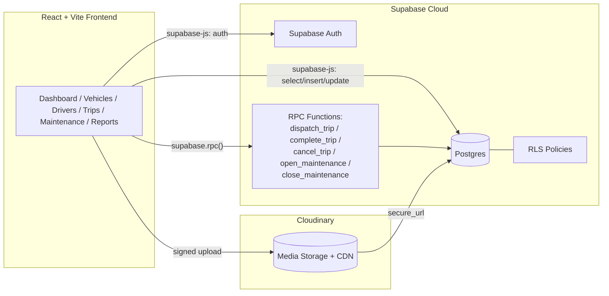
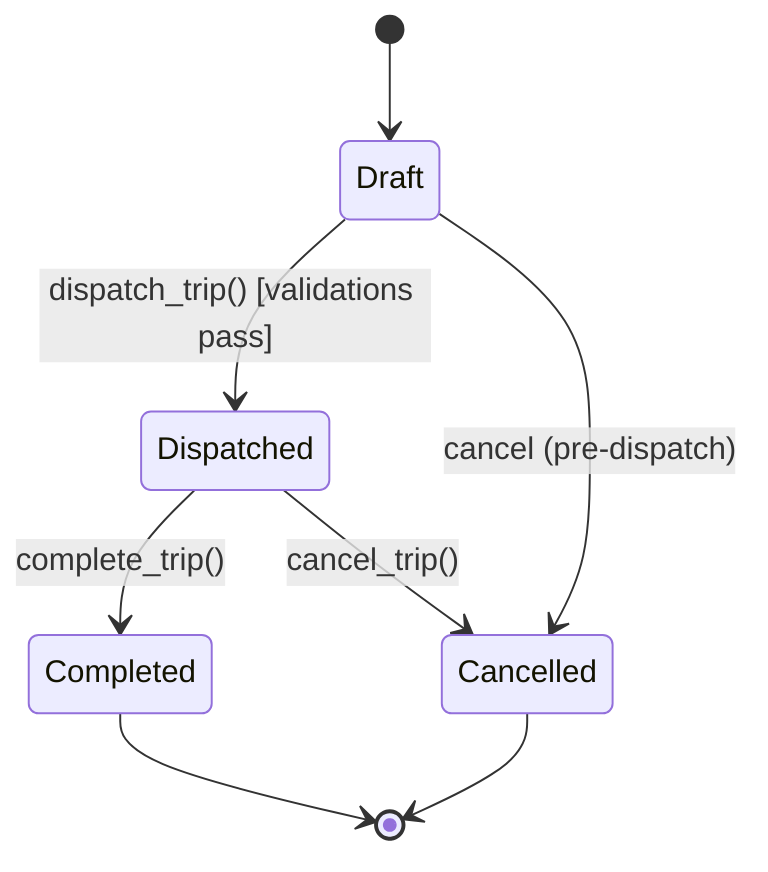

% TransitOps — Smart Transport Operations Platform
% Technical Documentation (Supabase + Cloudinary Edition)
% Hackathon Build Package

# Table of Contents

1. Executive Summary
2. Product Requirements (PRD)
3. Tech Stack
4. System Architecture (HLD)
5. Database Schema (Supabase / Postgres)
6. Row Level Security (RBAC via RLS)
7. Business Rules as Postgres RPC Functions
8. Cloudinary Integration (File & Image Storage)
9. Frontend Architecture
10. Data Access Layer (API Surface)
11. Dashboard & Reports / Analytics Logic
12. Trip Lifecycle & State Machine
13. Security Notes
14. Testing Checklist
15. Deployment Guide
16. 8-Hour Build Timeline
17. Demo Script (Judges)

---

# 1. Executive Summary

TransitOps is a centralized transport-operations platform covering vehicle registry, driver
management, trip dispatch, maintenance workflow, fuel/expense tracking, and operational
analytics. This edition is built on **Supabase** (Postgres + Auth + RLS + RPC) for the backend
and **Cloudinary** for all file/image storage (driver license scans, vehicle photos, maintenance
invoices, expense receipts). The goal is to remove backend boilerplate entirely so the 8-hour
build time goes into business logic and UI polish rather than plumbing.

Roles: **Fleet Manager, Driver, Safety Officer, Financial Analyst** — enforced via Postgres RLS
policies keyed off a `role` column on `profiles`, not custom middleware.

---

# 2. Product Requirements (PRD)

## 2.1 Modules
- Authentication + RBAC
- Dashboard (KPIs, filters)
- Vehicle Registry (CRUD, unique reg. number, status lifecycle)
- Driver Management (CRUD, license validity, safety score)
- Trip Management (Draft → Dispatched → Completed → Cancelled)
- Maintenance Workflow (auto vehicle status flip)
- Fuel & Expense Logging (auto cost rollups)
- Reports & Analytics (fuel efficiency, utilization, cost, ROI, CSV export)

## 2.2 Mandatory Business Rules
| Rule | Enforcement point |
|---|---|
| Registration number unique | Postgres `UNIQUE` constraint |
| Retired/In Shop vehicles excluded from dispatch pool | Query filter + RPC guard |
| Expired-license or Suspended drivers cannot be assigned | `dispatch_trip()` RPC check |
| On-Trip vehicle/driver cannot be double-assigned | `dispatch_trip()` RPC check + row lock |
| Cargo weight ≤ max load capacity | `dispatch_trip()` RPC check |
| Dispatch flips vehicle+driver → On Trip | `dispatch_trip()` RPC (atomic) |
| Complete flips vehicle+driver → Available | `complete_trip()` RPC (atomic) |
| Cancel restores vehicle+driver → Available | `cancel_trip()` RPC (atomic) |
| Active maintenance record → vehicle In Shop | `open_maintenance()` RPC |
| Closing maintenance → vehicle Available (unless Retired) | `close_maintenance()` RPC |

All state-changing rules live in **Postgres RPC functions**, not in the frontend — this keeps
them atomic (single transaction, row-locked) and judge-defensible ("server is authoritative,
not the UI").

---

# 3. Tech Stack

| Layer | Choice | Why |
|---|---|---|
| Frontend | React + Vite + TypeScript + Tailwind + shadcn/ui | Fast scaffold, component library out of the box |
| Backend / DB | **Supabase** (Postgres + Auth + Auto-REST + RLS + RPC) | No custom backend to write — auth and CRUD in minutes |
| File/Image storage | **Cloudinary** (unsigned upload widget / signed uploads via Supabase Edge Function) | License scans, vehicle photos, maintenance/expense receipts; on-the-fly image transforms (thumbnails for dashboard) |
| Business logic | Postgres `plpgsql` functions called via `supabase.rpc()` | Atomic, server-side, race-condition safe |
| Charts | Recharts | KPI + analytics visualizations |
| Hosting | Vercel (frontend), Supabase Cloud (DB/Auth), Cloudinary Cloud (media) | Zero backend server to deploy/maintain |

**Why Cloudinary alongside Supabase Storage:** Supabase Storage would also work, but Cloudinary
gives free on-the-fly transformations (auto-thumbnail for vehicle photos on the dashboard,
auto-format/auto-quality for license scans) without writing resize logic — a meaningful judge-
visible polish item for near-zero extra build time. Store only the returned Cloudinary
`secure_url` + `public_id` in Postgres; Cloudinary is the source of truth for the binary asset.

---

# 4. System Architecture (HLD)



No custom Node/Express server exists in this architecture. The only "backend code" beyond
Supabase config is:
1. Postgres RPC functions (business rules)
2. One optional Supabase Edge Function to generate signed Cloudinary upload signatures (keeps
   the Cloudinary API secret off the client)

---

# 5. Database Schema (Supabase / Postgres)

```sql
-- Profiles (extends Supabase auth.users, holds role for RBAC)
create table profiles (
  id uuid primary key references auth.users(id) on delete cascade,
  full_name text not null,
  role text not null check (role in ('fleet_manager','driver','safety_officer','financial_analyst')),
  created_at timestamptz default now()
);

-- Vehicles
create table vehicles (
  id uuid primary key default gen_random_uuid(),
  registration_number text unique not null,
  name_model text not null,
  type text not null,
  max_load_capacity numeric not null,
  odometer numeric default 0,
  acquisition_cost numeric not null,
  status text not null default 'AVAILABLE'
    check (status in ('AVAILABLE','ON_TRIP','IN_SHOP','RETIRED')),
  photo_url text,          -- Cloudinary secure_url
  photo_public_id text,    -- Cloudinary public_id (for deletion/transforms)
  region text,
  created_at timestamptz default now()
);

-- Drivers
create table drivers (
  id uuid primary key default gen_random_uuid(),
  name text not null,
  license_number text unique not null,
  license_category text not null,
  license_expiry date not null,
  contact_number text,
  safety_score numeric default 100,
  status text not null default 'AVAILABLE'
    check (status in ('AVAILABLE','ON_TRIP','OFF_DUTY','SUSPENDED')),
  license_doc_url text,        -- Cloudinary secure_url
  license_doc_public_id text,
  created_at timestamptz default now()
);

-- Trips
create table trips (
  id uuid primary key default gen_random_uuid(),
  source text not null,
  destination text not null,
  vehicle_id uuid references vehicles(id),
  driver_id uuid references drivers(id),
  cargo_weight numeric not null,
  planned_distance numeric,
  final_odometer numeric,
  fuel_consumed numeric,
  status text not null default 'DRAFT'
    check (status in ('DRAFT','DISPATCHED','COMPLETED','CANCELLED')),
  created_at timestamptz default now(),
  dispatched_at timestamptz,
  completed_at timestamptz,
  cancelled_at timestamptz
);

-- Maintenance Logs
create table maintenance_logs (
  id uuid primary key default gen_random_uuid(),
  vehicle_id uuid references vehicles(id) not null,
  description text not null,
  cost numeric default 0,
  status text not null default 'OPEN' check (status in ('OPEN','CLOSED')),
  receipt_url text,          -- Cloudinary secure_url
  receipt_public_id text,
  opened_at timestamptz default now(),
  closed_at timestamptz
);

-- Fuel Logs
create table fuel_logs (
  id uuid primary key default gen_random_uuid(),
  vehicle_id uuid references vehicles(id) not null,
  trip_id uuid references trips(id),
  liters numeric not null,
  cost numeric not null,
  log_date date default current_date,
  receipt_url text,
  receipt_public_id text
);

-- Expenses (tolls, misc)
create table expenses (
  id uuid primary key default gen_random_uuid(),
  vehicle_id uuid references vehicles(id) not null,
  category text not null,           -- 'toll' | 'maintenance' | 'other'
  amount numeric not null,
  expense_date date default current_date,
  receipt_url text,
  receipt_public_id text
);
```

**ER summary:** `profiles(1)—(n)` via `auth.users`; `vehicles(1)—(n)trips`, `vehicles(1)—(n)maintenance_logs`,
`vehicles(1)—(n)fuel_logs`, `vehicles(1)—(n)expenses`; `drivers(1)—(n)trips`.

---

# 6. Row Level Security (RBAC via RLS)

RLS replaces custom auth middleware. Enable RLS on every table, then scope by role.

```sql
alter table vehicles enable row level security;
alter table drivers enable row level security;
alter table trips enable row level security;
alter table maintenance_logs enable row level security;
alter table fuel_logs enable row level security;
alter table expenses enable row level security;

-- Everyone authenticated can read (dashboard needs cross-role visibility)
create policy "read_all_authenticated" on vehicles
  for select using (auth.role() = 'authenticated');

-- Only Fleet Manager can insert/update vehicles
create policy "fleet_manager_write_vehicles" on vehicles
  for all using (
    exists (select 1 from profiles p where p.id = auth.uid() and p.role = 'fleet_manager')
  );

-- Only Safety Officer can update driver compliance fields (license/status/safety_score)
create policy "safety_officer_write_drivers" on drivers
  for update using (
    exists (select 1 from profiles p where p.id = auth.uid() and p.role = 'safety_officer')
  );

-- Drivers and Fleet Managers can create/dispatch trips
create policy "create_trips" on trips
  for insert using (
    exists (select 1 from profiles p where p.id = auth.uid()
            and p.role in ('driver','fleet_manager'))
  );

-- Financial Analyst: read-only on fuel_logs/expenses/maintenance_logs (already covered by
-- read_all_authenticated); write restricted to Fleet Manager for maintenance/fuel entry.
```

Apply the same read-all / role-scoped-write pattern to the remaining tables. Keep policies
short and named clearly — judges can read `pg_policies` output directly as documentation.

---

# 7. Business Rules as Postgres RPC Functions

These are the only places mutation logic lives. Each is a single atomic transaction with row
locks (`for update`) to prevent race conditions on concurrent dispatch.

```sql
-- Dispatch a trip
create or replace function dispatch_trip(p_trip_id uuid)
returns void as $$
declare
  v_vehicle vehicles%rowtype;
  v_driver  drivers%rowtype;
  v_trip    trips%rowtype;
begin
  select * into v_trip from trips where id = p_trip_id for update;
  select * into v_vehicle from vehicles where id = v_trip.vehicle_id for update;
  select * into v_driver  from drivers  where id = v_trip.driver_id  for update;

  if v_vehicle.status != 'AVAILABLE' then raise exception 'VEHICLE_NOT_AVAILABLE'; end if;
  if v_driver.status  != 'AVAILABLE' then raise exception 'DRIVER_NOT_AVAILABLE';  end if;
  if v_driver.license_expiry < current_date then raise exception 'DRIVER_LICENSE_EXPIRED'; end if;
  if v_trip.cargo_weight > v_vehicle.max_load_capacity then raise exception 'CARGO_EXCEEDS_CAPACITY'; end if;

  update trips    set status = 'DISPATCHED', dispatched_at = now() where id = p_trip_id;
  update vehicles set status = 'ON_TRIP' where id = v_vehicle.id;
  update drivers  set status = 'ON_TRIP' where id = v_driver.id;
end;
$$ language plpgsql security definer;

-- Complete a trip
create or replace function complete_trip(p_trip_id uuid, p_final_odometer numeric, p_fuel_consumed numeric)
returns void as $$
declare v_trip trips%rowtype;
begin
  select * into v_trip from trips where id = p_trip_id for update;
  if v_trip.status != 'DISPATCHED' then raise exception 'TRIP_NOT_DISPATCHED'; end if;

  update trips set status='COMPLETED', completed_at=now(),
         final_odometer=p_final_odometer, fuel_consumed=p_fuel_consumed
  where id = p_trip_id;

  update vehicles set status='AVAILABLE', odometer=p_final_odometer where id = v_trip.vehicle_id;
  update drivers  set status='AVAILABLE' where id = v_trip.driver_id;
end;
$$ language plpgsql security definer;

-- Cancel a dispatched trip
create or replace function cancel_trip(p_trip_id uuid)
returns void as $$
declare v_trip trips%rowtype;
begin
  select * into v_trip from trips where id = p_trip_id for update;
  if v_trip.status != 'DISPATCHED' then raise exception 'TRIP_NOT_DISPATCHED'; end if;

  update trips set status='CANCELLED', cancelled_at=now() where id = p_trip_id;
  update vehicles set status='AVAILABLE' where id = v_trip.vehicle_id;
  update drivers  set status='AVAILABLE' where id = v_trip.driver_id;
end;
$$ language plpgsql security definer;

-- Open a maintenance record
create or replace function open_maintenance(p_vehicle_id uuid, p_description text, p_receipt_url text default null, p_receipt_public_id text default null)
returns uuid as $$
declare v_id uuid;
begin
  insert into maintenance_logs (vehicle_id, description, receipt_url, receipt_public_id)
  values (p_vehicle_id, p_description, p_receipt_url, p_receipt_public_id)
  returning id into v_id;

  update vehicles set status='IN_SHOP' where id = p_vehicle_id and status != 'RETIRED';
  return v_id;
end;
$$ language plpgsql security definer;

-- Close a maintenance record
create or replace function close_maintenance(p_log_id uuid, p_cost numeric)
returns void as $$
declare v_vehicle_id uuid;
begin
  update maintenance_logs set status='CLOSED', cost=p_cost, closed_at=now()
  where id = p_log_id
  returning vehicle_id into v_vehicle_id;

  update vehicles set status='AVAILABLE'
  where id = v_vehicle_id and status != 'RETIRED';
end;
$$ language plpgsql security definer;
```

Frontend calls these via `supabase.rpc('dispatch_trip', { p_trip_id })` — never mutate
`vehicles`/`drivers`/`trips` status columns directly from the client for these transitions
(RLS should in fact block direct status writes to enforce this).

---

# 8. Cloudinary Integration (File & Image Storage)

## 8.1 What goes to Cloudinary
- Driver license scans (`drivers.license_doc_url`)
- Vehicle photos (`vehicles.photo_url`)
- Maintenance invoice/receipt photos (`maintenance_logs.receipt_url`)
- Fuel/expense receipt photos (`fuel_logs.receipt_url`, `expenses.receipt_url`)

## 8.2 Upload flow (signed, recommended)
Client never holds the Cloudinary API secret. A small Supabase Edge Function mints a signed
upload signature; the browser uploads directly to Cloudinary; only the returned URL/public_id
is written to Postgres.

```ts
// supabase/functions/cloudinary-sign/index.ts (Edge Function)
import { serve } from "https://deno.land/std/http/server.ts";
import { createHash } from "node:crypto";

serve(async (req) => {
  const { folder } = await req.json();
  const timestamp = Math.floor(Date.now() / 1000);
  const paramsToSign = `folder=${folder}&timestamp=${timestamp}${Deno.env.get("CLOUDINARY_API_SECRET")}`;
  const signature = createHash("sha1").update(paramsToSign).digest("hex");
  return new Response(JSON.stringify({
    signature, timestamp, folder,
    apiKey: Deno.env.get("CLOUDINARY_API_KEY"),
    cloudName: Deno.env.get("CLOUDINARY_CLOUD_NAME"),
  }), { headers: { "Content-Type": "application/json" } });
});
```

```ts
// frontend upload helper
async function uploadToCloudinary(file: File, folder: string) {
  const { data } = await supabase.functions.invoke("cloudinary-sign", { body: { folder } });
  const form = new FormData();
  form.append("file", file);
  form.append("api_key", data.apiKey);
  form.append("timestamp", data.timestamp);
  form.append("signature", data.signature);
  form.append("folder", data.folder);

  const res = await fetch(`https://api.cloudinary.com/v1_1/${data.cloudName}/auto/upload`, {
    method: "POST", body: form,
  });
  const json = await res.json();
  return { url: json.secure_url, publicId: json.public_id };
}

// usage: vehicle photo
const { url, publicId } = await uploadToCloudinary(file, "transitops/vehicles");
await supabase.from("vehicles").update({ photo_url: url, photo_public_id: publicId }).eq("id", vehicleId);
```

## 8.3 Fast path (unsigned, if time is critically short)
Create an **unsigned upload preset** in Cloudinary dashboard scoped to a fixed folder (e.g.
`transitops_uploads`, max file size capped, allowed formats capped). Skip the Edge Function
entirely and POST directly from the browser using the preset name. Less secure (anyone with the
preset name can upload) but acceptable for an 8-hour hackathon demo — swap to signed uploads
post-hackathon.

## 8.4 Display / transforms
Use Cloudinary URL transformations for free thumbnailing on the dashboard, no server resize code:
```
https://res.cloudinary.com/<cloud_name>/image/upload/w_200,h_150,c_fill,q_auto,f_auto/<public_id>
```

---

# 9. Frontend Architecture

```
src/
  lib/
    supabaseClient.ts     -- supabase-js init
    cloudinary.ts          -- upload helper
  hooks/
    useAuth.ts
    useVehicles.ts / useDrivers.ts / useTrips.ts / useMaintenance.ts / useFuelLogs.ts
  pages/
    Login.tsx
    Dashboard.tsx
    Vehicles.tsx / VehicleForm.tsx
    Drivers.tsx / DriverForm.tsx
    Trips.tsx / TripDispatchModal.tsx
    Maintenance.tsx
    FuelExpenses.tsx
    Reports.tsx
  components/
    KpiCard.tsx / StatusBadge.tsx / DataTable.tsx / FilterBar.tsx
```

Routing: React Router, role-aware nav (hide Fleet-Manager-only actions for other roles — RLS is
the real enforcement, UI hiding is just UX).

---

# 10. Data Access Layer (API Surface)

No custom REST endpoints. Direct `supabase-js` calls replace them:

| Action | Call |
|---|---|
| List available vehicles for dispatch | `supabase.from('vehicles').select('*').eq('status','AVAILABLE')` |
| List drivers eligible for dispatch | `supabase.from('drivers').select('*').eq('status','AVAILABLE').gt('license_expiry', today)` |
| Create trip (Draft) | `supabase.from('trips').insert({...})` |
| Dispatch | `supabase.rpc('dispatch_trip', { p_trip_id })` |
| Complete | `supabase.rpc('complete_trip', { p_trip_id, p_final_odometer, p_fuel_consumed })` |
| Cancel | `supabase.rpc('cancel_trip', { p_trip_id })` |
| Open maintenance | `supabase.rpc('open_maintenance', { p_vehicle_id, p_description, p_receipt_url, p_receipt_public_id })` |
| Close maintenance | `supabase.rpc('close_maintenance', { p_log_id, p_cost })` |
| Log fuel | `supabase.from('fuel_logs').insert({...})` |
| Log expense | `supabase.from('expenses').insert({...})` |

Realtime (optional bonus): `supabase.channel('trips').on('postgres_changes', ...)` for a live
dashboard without polling.

---

# 11. Dashboard & Reports / Analytics Logic

KPIs computed client-side from Supabase views/queries, or as SQL views for zero client math:

```sql
create view v_fleet_kpis as
select
  count(*) filter (where status != 'RETIRED') as active_vehicles,
  count(*) filter (where status = 'AVAILABLE') as available_vehicles,
  count(*) filter (where status = 'IN_SHOP') as vehicles_in_maintenance,
  (select count(*) from trips where status = 'DISPATCHED') as active_trips,
  (select count(*) from trips where status = 'DRAFT') as pending_trips,
  (select count(*) from drivers where status = 'ON_TRIP') as drivers_on_duty,
  round(100.0 * count(*) filter (where status = 'ON_TRIP') / nullif(count(*) filter (where status != 'RETIRED'),0), 1) as fleet_utilization_pct
from vehicles;
```

**Formulas**
- Fuel Efficiency = `trip.planned_distance / SUM(fuel_logs.liters for that vehicle)`
- Operational Cost (per vehicle) = `SUM(fuel_logs.cost) + SUM(maintenance_logs.cost) + SUM(expenses.amount)`
- Vehicle ROI = `(Revenue − (Maintenance + Fuel)) / Acquisition Cost`
- Fleet Utilization % = `On-Trip vehicles / Active (non-retired) vehicles × 100`

CSV export: client-side (`papaparse` or simple `Blob` + `URL.createObjectURL`) from the already-
fetched report rows — no backend endpoint needed.

---

# 12. Trip Lifecycle & State Machine



---

# 13. Security Notes

- RLS on **every** table; default-deny, then add explicit policies (never `for all using (true)`
  on write).
- Cloudinary secret never shipped to client — only via signed Edge Function (Section 8.2).
- Postgres functions use `security definer` deliberately (so a Driver role can trigger
  `dispatch_trip` without needing table-level UPDATE grants) — keep these functions narrow and
  validated, since `security definer` bypasses RLS inside the function body.
- Row locks (`for update`) in every RPC prevent the double-dispatch race condition (two users
  dispatching the same vehicle simultaneously).
- Supabase Auth handles password hashing/session tokens — no custom bcrypt/JWT code needed.

---

# 14. Testing Checklist

- [ ] Register vehicle with duplicate registration number → rejected (unique constraint)
- [ ] Create trip with cargo weight > capacity → `CARGO_EXCEEDS_CAPACITY`
- [ ] Assign driver with expired license → `DRIVER_LICENSE_EXPIRED`
- [ ] Assign vehicle already On Trip → `VEHICLE_NOT_AVAILABLE`
- [ ] Dispatch → vehicle & driver flip to On Trip
- [ ] Complete → vehicle & driver flip to Available, odometer updates
- [ ] Cancel dispatched trip → both revert to Available
- [ ] Open maintenance → vehicle flips to In Shop, disappears from dispatch pool
- [ ] Close maintenance on non-retired vehicle → flips back to Available
- [ ] Retired vehicle never appears in dispatch pool, even after maintenance close
- [ ] Upload vehicle photo / license scan / receipt via Cloudinary → URL persists correctly
- [ ] RLS: Driver role cannot write to `vehicles` table directly
- [ ] Concurrent dispatch of same vehicle by two sessions → only one succeeds

---

# 15. Deployment Guide

1. **Supabase**: create project → run schema SQL (Section 5) → run RLS policies (Section 6) →
   run RPC functions (Section 7) in SQL Editor.
2. **Cloudinary**: create account → note cloud name → create upload preset (unsigned fast-path)
   or set `CLOUDINARY_API_KEY`/`CLOUDINARY_API_SECRET` as Supabase Edge Function secrets (signed
   path) → deploy Edge Function: `supabase functions deploy cloudinary-sign`.
3. **Frontend**: set `.env` — `VITE_SUPABASE_URL`, `VITE_SUPABASE_ANON_KEY`,
   `VITE_CLOUDINARY_CLOUD_NAME` (+ preset name if unsigned).
4. **Vercel**: connect repo, set the same env vars, deploy. No backend server to deploy —
   Supabase and Cloudinary are already hosted.

---

# 16. 8-Hour Build Timeline

| Hours | Task |
|---|---|
| 0.0–0.5 | Supabase project + schema + RLS + RPC functions (paste SQL from Sections 5–7) |
| 0.5–1.0 | Vite + React scaffold, Tailwind + shadcn/ui, Supabase client, Auth pages |
| 1.0–2.0 | Vehicle Registry CRUD + Cloudinary photo upload |
| 2.0–3.0 | Driver Management CRUD + license doc upload |
| 3.0–4.5 | Trip Management + dispatch/complete/cancel wired to RPCs (critical path) |
| 4.5–5.5 | Maintenance workflow + receipt upload |
| 5.5–6.5 | Fuel & Expense logging + receipt upload |
| 6.5–7.5 | Dashboard KPIs + Reports (fuel efficiency, utilization, cost, ROI) + CSV export |
| 7.5–8.0 | Polish, smoke test (Van-05 + Alex scenario), deploy, demo prep |

---

# 17. Demo Script (Judges)

1. Log in as Fleet Manager → show Dashboard KPIs.
2. Register vehicle **Van-05** (500 kg capacity) with a photo upload → show it lands in
   Cloudinary-backed thumbnail on the list.
3. Register driver **Alex** with a valid license + license scan upload.
4. Create a trip with 450 kg cargo → dispatch → show vehicle/driver flip to On Trip live.
5. Attempt a second trip on the same vehicle → show `VEHICLE_NOT_AVAILABLE` guard firing.
6. Complete the trip with final odometer + fuel consumed → show both revert to Available.
7. Open a maintenance record on Van-05 → show it vanish from the dispatch dropdown instantly.
8. Close maintenance → show it reappear as Available.
9. Show Reports tab: fuel efficiency, operational cost, ROI, fleet utilization; export CSV.
10. Close with the architecture slide: "Zero custom backend server — Supabase RPC + RLS handle
    every business rule atomically; Cloudinary handles every file with on-the-fly thumbnails."